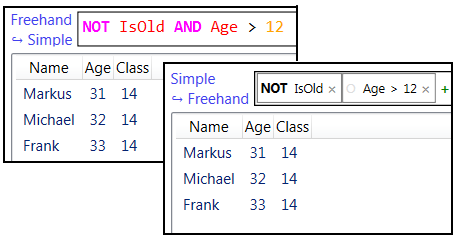

Configurable Query Language (CQL)
=================================



What is the problem?
--------------------

The raison d'être for this project is the typical filter problem:
On one side, your product delivers a dataset of complex types. On the other side
the user wants to **easily** query certain rows in the dataset. But you also want
to empower him to address **complex properties**.

Here is a solution!
-------------------

The two components, provided here, are

* a query language, that can be configured from a high-level point of view
  (like "my data has a field 'Name' of type 'String'") or/and from a low-level
  point of view (like "Use '+' to concat strings.")
* a WPF user control (using the language) with auto-completion and tooltips for
  syntactical and semantical errors. The query can be typed in using the keyboard
  OR by clicking all ingredients together.

Quickstart
----------

First, installation

```
PM> Install-Package CQL
```

Second, let me shortly explain the concepts. You actually need to provide three objects:

* the *query*, which can be edited by the user
* the *context*, which contains all variables, that are accessible for the query
* the *type system*, which setups the way the variables can be queried or can be combined

Third, study the following code snippet:

```csharp
[CQLType("Ticket", "Object of interest.")]
public class Ticket
{
	public Ticket(int id, string owner)
	{
		this.Id = id;
		this.Owner = owner;
	}

	[CQLNativeMemberProperty("Id", IdDelimiter.Dot)]
	public int Id { get; set; }

	[CQLNativeMemberProperty("Owner", IdDelimiter.Dot)]
	public string Owner { get; set; }
}
...
var typeSystemBuilder = new TypeSystemBuilder();
typeSystemBuilder.AddFromScan(typeof(Ticket));
var typeSystem = typeSystemBuilder.Build();

//DATA
var ticket1 = new Ticket() { Id = 123, Owner = "Me" };
var ticket2 = new Ticket() { Id = 124, Owner = "Myself" };
var ticket3 = new Ticket() { Id = 125, Owner = "I" };

//QUERY
var context = new EvaluationScope(typeSystem);
Assert.IsFalse(Queries.Evaluate("id > 123", ticket1, context));
Assert.IsFalse(Queries.Evaluate("id > 123 AND Owner = \"I\"", ticket2, context));
Assert.IsTrue(Queries.Evaluate("ID > 123 AND oWnEr = \"I\"", ticket3, context));
```

Current features
----------------

* configurable type system
* configurable context
* configurable WPF component (in progress!!!)
	* beginner mode
	* expert mode
	* auto completion
	* syntax highlighting
